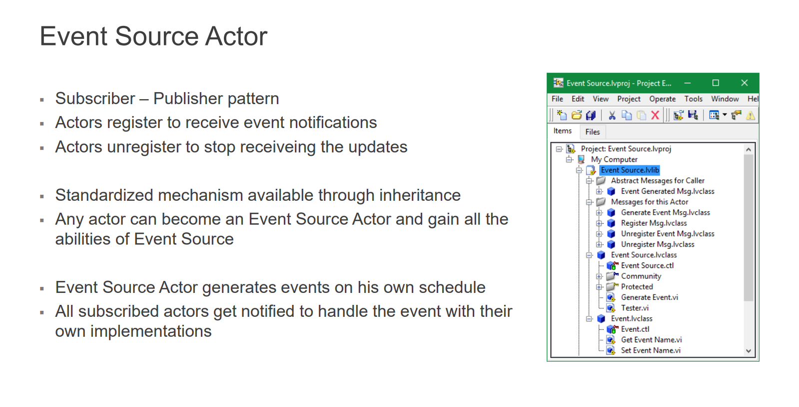
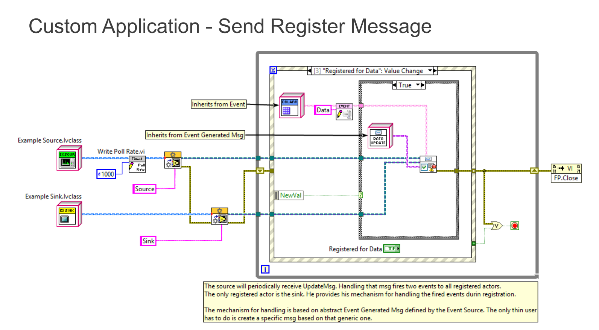
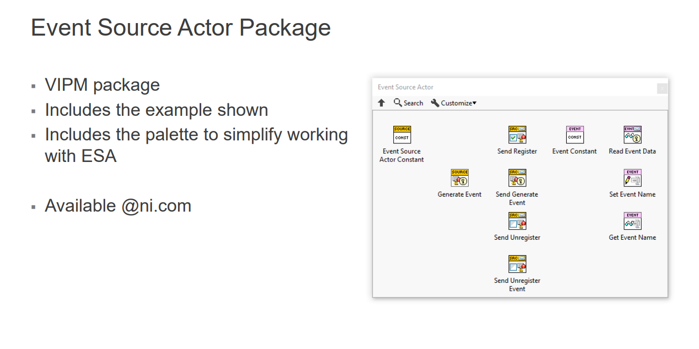
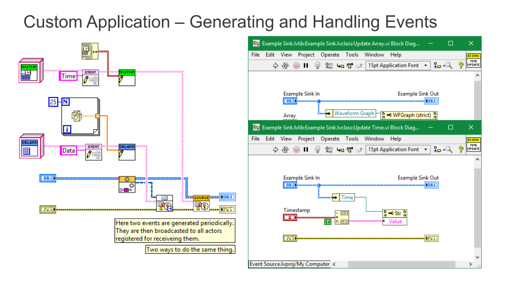

# Event Source Actor
Actor for LabVIEW Actor Framework implementing publisher subscriber model of communication with zero coupling

**Source LabVIEW Version:** 2019 

**Author:** Piotr Kruczkowski

# Introduction 
I wanted to share with you a small example actor I wrote to help me with typical subscribing/registering actors.
I have separated the functionality of registering, generating and unregistering from events. These events can be generated by the event source actor and are automatically broadcast to every actor who registered using Zero Coupling based message.
Broadcasting mechanism is based on the names of events defined by the user.
Please have a look at the code, run the example and let me know what you think.
 

# Usage
To create/use a new event sink user needs to:
1. Create or select Event classes to be used for passing data.
2. Create new messages from abstract Event Generated Msg.class, for handling events on the sink side.
3. Register for events with the new event class, the actors enqueuer and Zero Coupling based message for handling that event.
 
To create/use a new event source user needs to:
1. Create or select Event classes to be used for passing data.
2. Add Event Source Actor to data of your class or make your class inherit from Event Source Actor.
3. Fire events of specific types.
 
The code is quite efficient (faster than array search) because it uses a dictionary for storing registered actors and events.

# Criticism of Subscriber Publisher communication model
https://www.wikiwand.com/en/Publish%E2%80%93subscribe_pattern#Disadvantages
